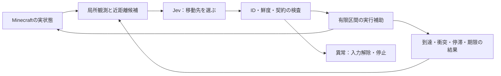

# Jevの判断と有限区間の実行補助を分離する方針

決定日：2026-09-20

親：[Issue #37](https://github.com/blancaile/minecraft-ai/issues/37)／次の実装・評価：[Issue #40（P1b）](https://github.com/blancaile/minecraft-ai/issues/40)

状態：ユーザー承認により方向転換を決定。設計・Issue・運用ルールを更新した。補助付き制御の実装と実機評価は未実施。

## 1. 変更する方針と理由

主開発を、Jevが近距離の移動先や行動の継続・撤退を選び、コードが選択された短い区間を実行する構成へ移す。直接ボタンを選ぶ既存方式は比較用に残す。

P1aでは、元の壁0/3、壁配置変更3/3、初期向き変更3/3となった。元の壁では、壁際の往復と、壁を抜けた後に目標から離れる横移動が残った。観測表現の5案を比較しても元条件は解決していない。[実験レポート](../operations/jev-control-p1a-experiment-report-2026-09-20.md)

次に検証する仮説は、yawに依存したボタン操作を毎回選ぶ負担を、空間上の行き先の選択と、その区間の実行に分けることで軽減できる、というもの。ただし方向選択自体の失敗もあったため、実行補助の追加だけで到達が改善すると決めつけない。

先行OSSは観測表現のほか、判断分解・操作合成・攻略promptを組み合わせていた。今回も構成全体としての有効性を評価し、成功したときの寄与をJev単独へ帰属させない。調査の固定commitと比較上の限界は上記レポートに記載している。

## 2. 判断と実行の担当

| 処理 | 担当 | 境界 |
|---|---|---|
| 局所観測、距離、身体幅、候補点の座標計算 | コード | 観測の範囲とUNKNOWNを維持。候補を攻略上の好みで選別・順位付けしない |
| 進む方向・近距離の移動先の選択 | Jev | 目標へ近づく・横へ回る・離れる・待つという選択を残す |
| 選択区間内の向きと入力の変換・補正 | コード | 固定した近距離終点だけを追う。目標の置換・延長・迂回先の選択をしない |
| 衝突・停滞・期限・取消による停止 | コード | 入力解除と結果返却。新しい移動先は次のJev判断で選ぶ |
| 迂回の継続、目標への復帰、後退 | Jev | 実行補助の内部で分岐を隠さない |
| API異常・不正応答・鮮度違反 | コード | 解除してERROR。別policyや既定行動で補完しない |

## 3. 最初の実装契約

実行モードをrun開始時に`direct`または`assisted`へ固定する。実行途中の自動切替は行わない。現時点の配布JARは既存の直接操作方式であり、以下は#40で実装する契約である。

- 候補は、全8方位の近距離点、既知目標方向の近距離点、WAITを基本とする。同じ座標の候補は統合し、その規則を記録する。目標方向の点は幾何計算で生成する候補の一つであり、自動選択しない。
- 1区間は水平1block以下、実行12tick以下。WAITは4tick。終点の許容誤差、停滞の定義、観測範囲の検査は実装時に数値を固定し、実API実行前のplanへ記録する。
- Jevには候補IDと実際の座標・方向・観測事実を提示し、選ばれた候補を区間契約へ結び付ける。正解経路、fixtureの条件名、左右どちらを回るべきかという結論は渡さない。
- 実行補助は身体の現在状態を使って、選択済み終点に向けた短い入力を補正できる。衝突などで成立しなくなったら止める。壁の横へ勝手にずれる、区間を延長する、別の終点へ置き換える処理は入れない。
- 観測範囲外を既知の空間と扱わない。未観測領域への進入が必要になったら、その区間の入力を解除し、新しい観測と結果をJevへ返す。
- 移動はVanillaの入力・衝突・重力を使い、teleportやvelocity直書きで位置を合わせない。今回は歩行の区間補助だけを対象とする。
- 期限管理と入力解除はAPI workerから独立させる。取消・死亡・dimension変更・disable後の遅着応答も実行しない。

成功したとしても、コードが操作の方向変換・終点への補正を担当した寄与を明示する。Jevが各tickの操作をすべて判断したとは報告しない。

## 4. 比較実験

### 共通条件と予算

Paper 1.21.11 build 116 / Java 21 / `jev-1.13.0`。開始位置`(0.5,81,0.5)`、到達半径1block。両方式を最大60 Jev判断・120秒・入力適用区間の累積240tickに制限する。WAITの区間も累積tickへ数える。API待ち中の無入力期間は別途記録する。

補助方式の1判断と直接方式の1判断は、同じ長さの仕事ではない。到達、経過時間、入力tick、実移動、Jev判断数、停止理由を併記する。古い#39の結果は背景資料とし、新しい共通条件で両方式を再評価する。

| 段階 | 条件 | 予定試行 |
|---|---|---:|
| 横ずれ診断 | 壁なし。目標`(-2.5,81,0.5)`／`(3.5,81,0.5)`、yaw 0／90の4組合せ、各方式1回 | 8 |
| 開発 | assistedの原因切分け・変更比較・必要な再診断。各実行前に仮説とartifactを固定 | 最大6 |
| 固定最終比較 | #39の壁3配置・向き、各方式各条件3回 | 18 |

総上限32試行・1,920 Jev判断。診断のassistedが4/4到達することを壁評価へ進む条件とする。変更後の再診断も開発枠に数える。上限内で満たせない場合はその結果を報告し、試行を追加したことを隠さない。

### 壁の介入条件を共通化する

壁の座標と最終目標は#39の3条件を引き継ぐ。ただし「3cycles後」は方式によって移動距離が変わるため、最初に実位置のz>=2.5を観測した後に壁を1回追加する条件へ変える。検出・追加の実位置、tick、選択中の区間を保存し、壁を既に通過した後の介入を有効な壁試行に数えない。

この変更により、#39と同一条件の再現実験とは呼ばない。新条件でdirectとassistedを比較し、追加直後の変化に対して実行補助が停止し、Jevが選び直す過程を確認する。

最終評価の方式順は事前に均衡化する。開発中の成功を最終評価へ加算せず、最終評価中にprompt・候補・設定・artifactを変更しない。各壁条件でassistedが3回中2回以上到達することを小規模な通過基準とする。

### 帰属できる効果の範囲

この比較では、候補表現、操作粒度、実行補正が一緒に変わる。最初は方式全体が有効かを測り、補正だけの因果効果を主張しない。必要な追加比較は結果を受けて別途計画する。両方式のprompt・候補生成をそれぞれ公開し、違いを報告する。

## 5. 証跡と完了条件

Jevのrequest・候補・選択、区間の開始と終点、毎tickの実入力と補正理由、実座標、停止理由を同じ区間IDで追跡する。衝突後に移動先が変わるときは、新しいJev判断が存在することを監査する。区間終了時の慣性による移動を入力継続と混同しない。

ローカル試験、実Paperの身体・停止試験、モデルの到達評価を別々に判定する。予定した試行を実施したことと、到達基準を満たしたことも区別する。失敗を含む全試行と後始末を保存する。

最終報告はMarkdownで、目的、先行調査との関係、仮説、固定条件、方法、全結果、考察、限界、再現手順を記載する。Issue本文へ結論と直接リンクを追記し、反映を読み戻してから終了報告する。

## 6. 旧実験と作業状態

- #39は未達の比較記録として保持する。新方式の成功を#39の受入条件達成へ読み替えない。旧レポート・設定・生traceは変更しない。
- #37の主方針と次の実装課題を更新し、#40を補助付き制御の作業先とする。
- A*などの経路探索、複数区間の自動追従、自動迂回、ジャンプ・段差攻略、採集、戦闘、複数体、長期記憶は今回の範囲外。
- 本決定で共有サーバーへ新方式を配置しない。まず隔離Paperで比較する。
- この方針変更の成果物は、設計文書・Issue・作業ルールの更新。新しい制御コードと実験結果はまだない。文書間の参照と旧方針との整合を確認し、実装段階では#40の受入条件を検証する。
