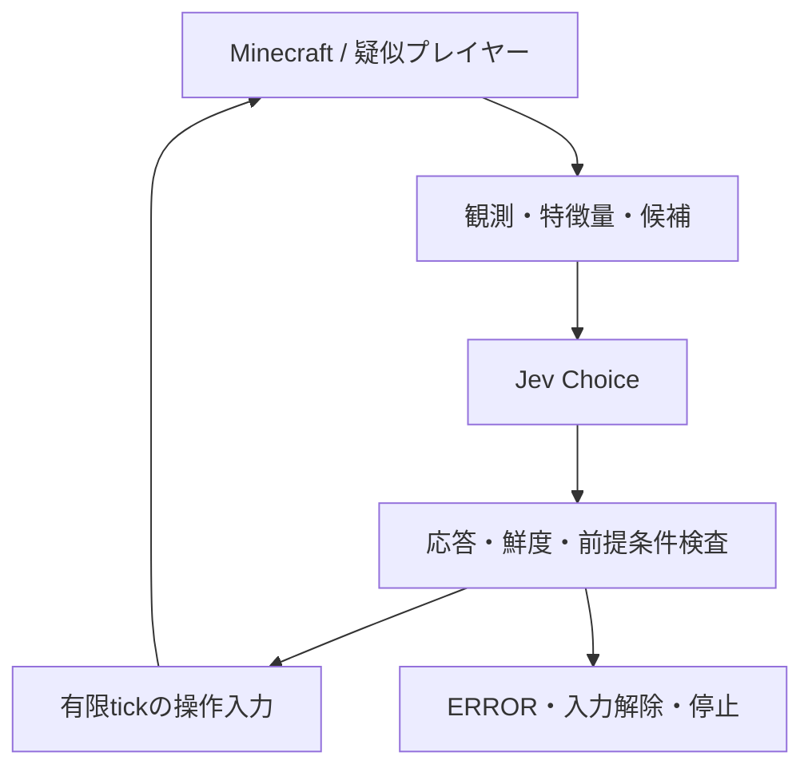

# Jev主導Minecraft制御：閉ループPoCから共同目標達成へ

更新日: 2026-09-19  
状態: 計画起票済み。新しい制御ループの実装・実機検証は未着手。

- 親計画: [#37](https://github.com/blancaile/minecraft-ai/issues/37)
- 最初の実装: [#38 — P0](https://github.com/blancaile/minecraft-ai/issues/38)
- 並行する調査: [#36](https://github.com/blancaile/minecraft-ai/issues/36)
- 作業ブランチ: `feat/jev-embodied-control`
- 分岐元: `main@1d53ae9203fe8d620912851f5d9da36ab2f68980`

## 1. 目標と最初の一歩

Jevを意思決定主体として、1体以上の疑似プレイヤーがMinecraftの状態を観測し、行動し、結果を受けて次の行動を選ぶ。将来の目標例は、複数体が協調してエンダードラゴンを討伐すること。

最初は、1体の観測→判断→操作→再観測を実際のゲーム内で閉じる。全Minecraft事象の棚卸し、全高級Skillの分解、長期計画機構、協調機構を先に完成させない。

閉ループの成立は、長期攻略の必要な土台になるが、それだけでは長期計画能力や汎化能力を証明しない。配線の成功、単純目標の達成、環境適応、長期攻略、協調は別々に測る。

## 2. このブランチの実行方針

既存のResident製品計画・Gate A評価とは別のJev主導研究トラックとして進める。この文書と#37/#38を新ループの基準とする。

- 既存Gate Aの合格・mc_aiplayerの正式採用を宣言しない。
- M1の全項目完了を使い捨てPoCの前提にしない。
- 旧v2の常時フォールバックとLLMによる行動候補提案を、この新ループには適用しない。
- LLMは行動・目標分解・役割分担・候補生成を担当しない。会話が必要なら後続で分離する。
- 認証失敗、API timeout、不正response、欠損観測、stale responseはERRORとして返す。別モデル・ルール・ランダム・既定操作へ切り替えない。
- Rules/Randomは明示的に選ぶ独立比較run。Jevの失敗時に切り替える制御系ではない。

現在のmainには評価harnessと `tools/probes/jev_client.py` がある。後者は固定stateから単発回答を得るprobeであり、Minecraftの観測・入力・反復は接続されていない。

## 3. 最小構成

### Body

第一検証案はCarpet fake playerと薄いFabric adapter。既存fixtureのMinecraft 1.21.3を起点に、対応version・依存・APIと停止挙動を確認して固定する。互換性はまだ検証していない。現行Carpetのソースにはforward/strafe/turnと入力解除の低レベル操作が存在するが、対象versionで同じ形のAPIが使えると仮定しない。

Carpetを最終製品bodyに決定するものではない。失敗した場合は具体的な不足を記録し、body選定を明示的に更新する。実行時の別bodyへの自動切替は作らない。

`mc_aiplayer@a029fa6a3760fd0f83834c104051b041d986da60` は参照候補。確認した境界:

- `MovementAction.setForward/setStrafing/jumpOnce`: 短い入力の候補。
- `MovementAction.startWalkTo/startPathTo`: 今回の操作面に入れない。
- `ObservableWorldQuery`: 距離・raycastに基づく観測制限の参考。
- `PerceptionCollector` 等の全機能・transitive dependency調査は#36で継続。

身体を操作できることと、既存AIによる自動操縦を有効にすることを混同しない。upstream sourceを無条件に取り込まず、固定依存・独自adapter・参照のみの設計を区別する。

### 推論とtick

worldの読取と入力適用はserver thread。Jev HTTP呼び出しは別worker。MinecraftはAPI待ち中も進み続ける。

P0は1体1requestの直列判断とし、入力を有限tickで終了・解除してから次の観測/判断へ進む。API待ち中に前回入力を保持し続けない。これはAPI失敗を既定行動で埋める処理ではなく、通常サイクルの明示的な無入力期間。

各runでmodel、API timeout、入力duration、観測年齢上限、最大decision数、wall-time上限を設定として固定する。応答のepisode/bot/request/observation IDを検証し、取消・死亡・dimension変更後の応答を実行しない。入力の期限と停止処理はAPI workerから独立させる。

## 4. Jevへ渡す情報

| 群 | P0での内容 | 拡張時の内容 |
|---|---|---|
| 識別・時刻 | bot/episode/observation ID、tick、時刻 | team、schema、共有情報の由来 |
| 目標 | 既知目標の相対位置、到達半径 | mission進捗、未充足の前提、下位目標候補 |
| 自分 | 位置、向き、速度、接地、health | hunger、装備、inventory、cooldown |
| 形状 | 局所cell、支持面、障害物高、頭上空間 | region、boundary、passage、経路候補のcost |
| 他者 | 可視entity/playerのID、相対位置、観測した移動 | 共有された作業・資源・支援要請 |
| 相互作用 | 移動入力の機械的前提 | block/entity/itemに束縛したbreak/use/place/attack候補 |
| 履歴 | 前回操作、実行tick、移動量、衝突/停滞 | 有限長の遷移履歴、観測記憶 |
| 観測品質 | OBSERVED/REMEMBERED/UNKNOWN、観測時刻 | INFERREDと根拠・不確実性 |
| 候補 | ID、入力内容、duration、前提条件、除外理由 | 他者との競合、予約、切替コスト |

server側にデータがあるからといって、壁の向こうの資源や他プレイヤーのinventoryを無制限に読まない。観測範囲・遮蔽規則を明示し、UNKNOWNをair/false/ゼロで代用しない。PoCの目標座標はfixtureから与える特権情報として記録する。

「家」を認識しないと入れない構成にせず、空間・壁・開口部・閉じた通路・相互作用という観測で扱う。特定の建物ごとのif文を増やす前に、同じ形状/操作語彙で表せるか検証する。

## 5. 誰が判断するのか

| 処理 | 原則の担当 | 注意点 |
|---|---|---|
| block形状、距離、視線、速度、recipe算術 | コード | 計算結果と推測を区別する |
| 入力適用、衝突、重力、入力期限 | コード / Minecraft | 目標に応じた攻略分岐を混ぜない |
| 合法性・権限・明示hard constraintの検査 | コード | 「遠回りは不適切」等の攻略上の好みで候補を消さない |
| 右/左、進む/待つ、ジャンプ、対象選択 | Jev | 実際に複数の候補から選べたか記録する |
| 迂回/破壊/開く、攻撃/撤退、継続/切替 | Jev（後続） | 高級Skill内部で勝手に選ばせない |
| 目標達成の事実確認 | ゲーム状態に基づく検査 | Jevの自己申告やadapterの成功文字列をoracleにしない |

条件を特徴量へ移すだけでは十分でない。たとえばコードが `should_jump=true` を計算し、Jevへ「trueならjump」と教えると判断主体はほぼ移らない。`obstacle_height`、`headroom`、`on_ground`、`relative_velocity` のような測定事実を優先する。

候補集合を正解1つに絞ることでも同じ問題が起きる。candidate数、除外理由、コード側介入、prompt内の専用攻略知識を監査する。将来のA*は経路候補・距離・costを計算してよいが、複数の意味的に異なる戦略からの選択まで自動化しない。

すべてを低レベル入力で行うことが最終解とは限らない。高級Skillを再利用する場合は、意味的な分岐ごとに `NEED_DECISION(features, candidates)` を返し、短い区間だけ実行する形を#36で調べる。

## 6. P0の範囲と完了条件

詳細な実装順序・checkboxは[#38](https://github.com/blancaile/minecraft-ai/issues/38)を正とする。

初期候補は次の8種類。4tick/15度は調整可能な初期設定であり、性能保証ではない。

`WAIT_4T, FORWARD_4T, BACK_4T, STRAFE_LEFT_4T, STRAFE_RIGHT_4T, TURN_LEFT_15, TURN_RIGHT_15, JUMP_FORWARD_4T`

`move_to`、経路追従、自動ジャンプ、自動採集、自動戦闘は使わない。選んだ入力後に観測された衝突/停滞は正当な結果として次のJev判断へ返す。Javaが自動で別行動を選ばない。

検証は二つに分ける。

1. **接続・反復**: 1体のspawn/観測/入力/停止を確認し、実Jevで3run以上・合計100cycle以上を記録する。これは反復の最低観測量であり、成功率の統計保証ではない。
2. **目的・観測依存**: 初期向き/目標方向が異なる3設定を固定して全結果を記録し、少なくとも1設定で単純目標へ到達する。途中で障害物を追加したrunで、観測更新と再選択を追跡する。適応に失敗した場合はそのままP1の課題にする。

ERROR、死亡、取消、予算切れ、目標達成を別statusで保存する。API障害、不正action、stale response、取消後の遅着responseを注入し、入力解除と失敗終了を検証する。入力解除は重力/慣性まで消すことではなく、物理的な静止を偽って保証しない。

初期run予算案は200decisions、10分。動画に加え、snapshot・候補・Jev出力・適用入力・実行tick・次snapshot・停止理由を保存する。成功試行だけを選んで報告しない。

## 7. 先行事例の確認結果

本作業では資料とsourceを確認した。ゲーム実行・完全攻略の再現は行っていない。

| 参照 | 確認内容 | 取り込む考え方 / 限界 |
|---|---|---|
| [TypeSafe公式Doom紹介](https://typesafe.ai/blog/introducing-system-one-models-and-jev) | 画像ではなく構造化stateを使用 | 観測→typed判断の先例。紹介だけから全campaign攻略やMinecraft成功を推論しない |
| [fhshaik/typesafe-mario](https://github.com/fhshaik/typesafe-mario/tree/ca22449ed187118d19326d1f54b01b6636578aa4) | RAM/telemetryをplayer、terrain、hazard、reaction timing、recent controlへ整理しChoiceでボタン入力を選ぶ | コンパクトな環境表現。攻略結論に近い特徴量と詳細promptの寄与は別に評価する |
| [shantanugoel/mario-jev](https://github.com/shantanugoel/mario-jev/tree/14f0c289e48cd99e3b5b91353d0456fb1f32d499) | 短い入力、着地での区間中断、遷移履歴、入力再生。READMEはfull-level completion未実証と明記 | 履歴と結果feedbackを参照。API待ちでemulatorを止めるのでMinecraftの非同期性とは条件が違う |
| [AmoghCreator/doom-jev](https://github.com/AmoghCreator/doom-jev/tree/b27663fc0fa386f9d15ad6ea3c8f15374b855479) | 非同期loop、可視性制限。`composition_dag.py` に最近傍敵への代替・自動照準・自動射撃 | 観測/推論分離を参照。これらの自動選択や継続保持をそのまま採用しない |
| [mc_aiplayer固定SHA](https://github.com/zoyluoblue/mc_aiplayer/tree/a029fa6a3760fd0f83834c104051b041d986da60) | 低レベルmovement APIと観測filterを確認 | 身体/観測の参考。高級Skillの成功をJev自身の攻略能力と数えない |
| [Fabric Carpet](https://github.com/gnembon/fabric-carpet) | 現行sourceにfake playerのforward/strafe/turn/stop等がある | P0 body候補。対象Minecraft versionと依存SHAは実装時に検証・固定する |

MineDojo / Mineflayer / Baritone / Voyager / AltoClefとの全体比較は#36で継続する。MarioやDoomの「遊べる」と「完全攻略が再現された」は区別する。

## 8. 段階的な拡張

| 段階 | 課題 | 次に進むための証拠 |
|---|---|---|
| P0 | 1体の閉ループと単純目標 | #38の実機log・停止検証・到達結果 |
| P1 | 障害物、段差、通路、他者による環境変更 | 同じ語彙での再判断、失敗分類、Rules/Randomとの比較 |
| P2 | break/place/use、採集、inventory、craft/smelt | 短い資源獲得連鎖、Skill分岐のJev移管 |
| P3 | 探索、記憶、戦闘、生存、長期目標 | 複数stepの進捗維持、停滞からのJevによる方針変更 |
| P4 | 複数体の協調 | 小さな共同目標、役割変更、支援、資源競合の解消 |
| P5 | Nether、要塞、End、ドラゴン | 初期装備ありの限定課題から新規seedの一貫攻略へ |

P4はP2/P3の結果を利用して小さく着手できる。1体の高度な生活機能をすべて完成させるまで待つ必要はない。

後続では、Team / Tactical / Actionを異なる粒度・周期のJev判断として検討する。Jevが適性・優先度を選び、コードがその出力に基づく排他予約やmatchingを行う場合、そのsolverの目的関数に手書き戦略を隠さない。長期目標の依存グラフはrecipe/物理上の前提と手書き攻略順序を区別する。

ドラゴンについては少なくとも「装備済みEndでの戦闘」「資源を与えた攻略」「新規seed・資源なしの攻略」を別条件として扱う。最初の成功を一般的な自律攻略と呼ばない。

## 9. 評価と失敗分類

P0では簡単なtraceを優先し、大規模な評価基盤を先に作らない。以後は同じsensor/candidate generator/actuatorを固定してpolicyだけを比較する。

記録する失敗の区別:

- 観測不足・UNKNOWN・stale
- 必要な候補がない
- 候補はあるがJevが選べない
- 正しく選んだが身体が実行できない
- 遅延で適用時に前提が崩れた
- 単発は正しいが長期目標を維持できない
- 複数体で重複・競合した

semantic decision coverageだけではJevの寄与を証明できない。候補が複数あった割合、候補coverage、コード介入、環境変更への反応、Rules/Randomとの結果差も併記する。APIのconfidenceは任務成功率と同一視しない。

新しい特徴量、prompt、candidate filterを追加するたびに、どの失敗への仮説かを記録する。特定コースだけの攻略ルールを増やして改善した場合は、汎化の証拠と分ける。

## 10. 次に行うこと

#38の「身体を1体だけ出す」から実装する。身体・観測・入力・Jev接続を縦に通し、実機の最初のtraceを取る。未解決の設計項目は実測で絞り、P0終了時にFindingと次のP1 Issueを起票する。
